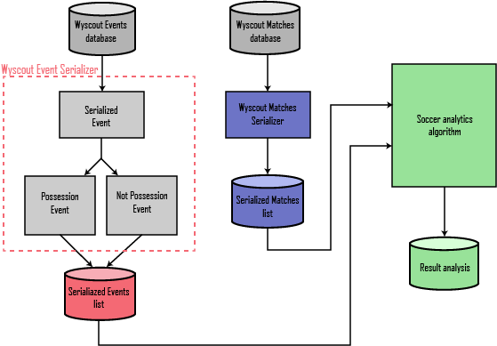

# Pysoccer

This repository contains the work done during an internship at PlayeRank with the help of professors Paolo Cintia and Luca Pappalardo. The goal has been to study the most commonly used data, in order to propose, developing Pysoccer, a package that works with data in a format capable of summarizing all the information found in the aforementioned data in a standardized way. Pysoccer offers a standardized data model designed to make data-driven soccer analytics easy. It aims to be the base format to build on all the community made analysis and make them comparable and able to "speak the same language". With Pysoccer everyone would be able to, develop its own serializer for its own data streams, and use a massive number of already made analytics tools or build some new ones. The use of the library will also allow to apply well known tools onto new data, that were developed for a different format or type. Possibly now with few changes we can revise most of the soccer analytics tools to work on Pysoccer data.

Pysoccer is developed in Python being one of the most used languages at the state-of-the-art. The language was also chosen because it provides a great number of useful libraries for data elaboration and visualization. The library is hosted on GitHub, being completely open source and hoping that it will gain popularity and it will lead to a growing number of functions and tools that uses it. The developing from scratch took about 6 months, during this period weekly meetings were held to discuss about the main design choices.

To validate the data format we developed a serializer able to convert the data, in JSON format, generated by one of the companies in the market, Wyscout, transforming the into serialized data as Pysoccer describes. We instantiated the serializer over a massive data set of soccer-logs that is unique in the large number of logged matches and players and for the length of the period of observation. In fact, it includes 31M of events covering around 20K matches and 21K players in the last four seasons of 18 soccer competitions: Spanish first division, English first division, Italian first division, German first division, French first division, Portuguese first division, Turkish first division, Greek first division, Austrian first division, Swiss first division, Russian first division, Dutch first division, Argentinian first division, Brazilian first division, European Champions League, Europa League, World Cup 2018, and European Cup 2016. Then to understand if there was a loss, or a gain, of information due to the serialization, we produced some analysis in the form of a Jupyter Notebook showing how the library is robust in the regards of the data. At a later time to add more to the validation we revised the PlayeRank framework to operate on the standardized data provided by Pysoccer. PlayeRank is a new-generation data-driven framework for the performance evaluation and the ranking of players in soccer.
